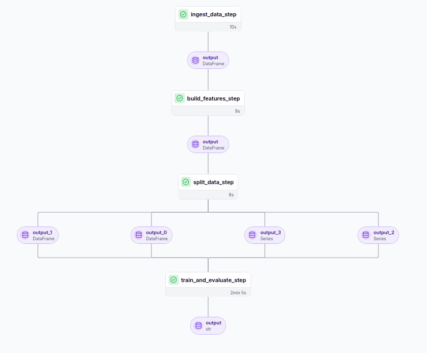

# 📈 Finance MLOps Portfolio Predictor

End-to-end **Machine Learning + MLOps** system for finance: it downloads **real market data**, engineers features, trains and compares several models with **ZenML** (so you can watch training & evaluation live in a dashboard), automatically picks a **champion model**, serves predictions through a **FastAPI** service, and **monitors live performance** — if the champion's real trading performance (Sharpe ratio) drops too much, it **automatically swaps in a better model** from the registry.

```
┌─────────────┐    ┌──────────────┐    ┌───────────────┐    ┌────────────────┐
│ Real market │ →  │   Feature    │ →  │  ZenML train  │ →  │  Model Registry │
│ data (yahoo)│    │  Engineering │    │ + evaluate all│    │  (champion.json)│
└─────────────┘    └──────────────┘    └───────────────┘    └────────┬────────┘
                                                                       │
                     ┌─────────────────────────────────────────────────┘
                     ▼
            ┌────────────────┐        ┌────────────────────┐
            │   FastAPI       │  ←──   │  Monitoring loop    │
            │  /predict       │  swap  │  (checks live PnL/  │
            │  /health        │  model │  Sharpe, retrains/  │
            │  /metrics       │        │  swaps if it drops) │
            └────────────────┘        └────────────────────┘
```

---


## What it does

1. **`src/data/ingest.py`** — downloads real historical OHLCV data for a list of tickers using the free [`yfinance`](https://pypi.org/project/yfinance/) API (Yahoo Finance). No API key needed.
2. **`src/features/build_features.py`** — builds classic quant features: returns, log-returns, rolling volatility, moving averages (SMA/EMA), RSI, MACD, momentum, and the prediction target (next-day return).
3. **`src/pipelines/`** — a **ZenML pipeline** that:
   - loads & splits the data (time-based, no leakage),
   - trains **4 candidate models** (Ridge, RandomForest, GradientBoosting, XGBoost),
   - evaluates each with regression metrics **and** finance metrics (directional accuracy, backtested Sharpe ratio, cumulative return),
   - picks the best model as **champion**, and writes it + its metrics to `models_registry/`.
4. **`src/api/main.py`** — a FastAPI app that loads the current champion and serves `/predict`, `/health`, `/metrics`, `/models` (list all trained candidates), and `/reload` (hot-swap champion without restart).
5. **`src/monitoring/monitor.py`** — a watchdog loop that re-evaluates the champion on the freshest data every N minutes. If its rolling Sharpe/PnL drops below a threshold, it **automatically promotes the best-performing runner-up model** from the registry (or retrains from scratch if none is good enough) — so your portfolio isn't stuck with a decaying model.

---

## Project structure

```
finance-mlops-portfolio/
├── README.md
├── requirements.txt
├── config.yaml                  # tickers, thresholds, dates — edit this first
├── scripts/
│   ├── setup.sh                 # 1) create venv, install deps, init zenml
│   ├── run_pipeline.sh          # 2) download data + train + evaluate (live dashboard)
│   └── start_api.sh             # 3) serve the champion model
├── src/
│   ├── data/ingest.py           # real Yahoo Finance data download
│   ├── features/build_features.py
│   ├── models/train.py          # model definitions + training/eval helpers
│   ├── pipelines/
│   │   ├── steps.py             # ZenML @step functions
│   │   └── training_pipeline.py # ZenML @pipeline definition
│   ├── monitoring/monitor.py    # live performance watchdog + auto model-switch
│   ├── api/main.py              # FastAPI serving app
│   └── utils/registry.py        # champion/model registry helper
├── models_registry/             # created at runtime: trained models + metrics
├── data/                        # created at runtime: raw + processed data
├── tests/test_pipeline.py
└── docker/Dockerfile
```

---

## Quickstart

### 0) Requirements
Python 3.10 or 3.11 recommended (ZenML compatibility).

### 1) Setup
```bash
cd finance-mlops-portfolio
bash scripts/setup.sh
```
This creates a virtualenv, installs everything, and runs `zenml init` + `zenml up`, which opens the **ZenML dashboard** at `http://127.0.0.1:8237` — keep this open, this is where you'll watch pipeline runs and model metrics **live**.

### 2) Configure
Edit `config.yaml` — pick your tickers, date range, and risk thresholds:
```yaml
tickers: ["AAPL", "MSFT", "GOOGL", "SPY"]
start_date: "2015-01-01"
end_date: null            # null = today
sharpe_drop_threshold: 0.3   # if champion's live Sharpe falls below this → auto-switch
check_interval_minutes: 60
```

### 3) Download data, train, and evaluate (live)
```bash
bash scripts/run_pipeline.sh
```
Watch progress in the terminal, and open the ZenML dashboard to see each step (data load → features → train Ridge/RF/GBM/XGB → evaluate → champion selection) run in real time, with metrics per model.

At the end you'll see something like:
```
Model            RMSE     DirAcc   Sharpe   CumReturn
Ridge            0.0132   0.51     0.42     0.18
RandomForest      0.0119   0.55     0.71     0.29
GradientBoosting  0.0115   0.56     0.77     0.33   ← CHAMPION
XGBoost          0.0117   0.55     0.74     0.31

✅ Champion saved: models_registry/champion.pkl (GradientBoosting)
```

### 4) Serve predictions via API
```bash
bash scripts/start_api.sh
```
Then:
```bash
curl http://127.0.0.1:8000/health
curl http://127.0.0.1:8000/predict -X POST -H "Content-Type: application/json" \
     -d '{"ticker": "AAPL"}'
curl http://127.0.0.1:8000/models
```


### 5) Live monitoring + auto model switching
```bash
python src/monitoring/monitor.py
```
This runs forever (or use `--once` for a single check), re-scoring the champion on the latest market data. If real trading performance (Sharpe) degrades past `sharpe_drop_threshold` in `config.yaml`, it will:
1. Try to promote the best non-champion model already in the registry that currently performs better, or
2. Trigger the ZenML pipeline again to retrain everything on fresh data,

then hot-reloads the API automatically (`POST /reload`) — zero downtime.

---

## Why these design choices

- **Time-based train/test split** — no shuffling, because shuffling financial time series causes lookahead bias and inflated results.
- **Multiple finance-specific metrics, not just RMSE** — a model can have low error but be useless if its directional accuracy or backtested Sharpe is bad. The champion is selected on a blended score of RMSE + Sharpe + directional accuracy.
- **Champion/challenger pattern** — this is standard MLOps practice for finance: never deploy blindly, always keep runner-up models around so you can roll back/switch instantly instead of waiting for a slow retrain.
- **ZenML** — gives you pipeline caching (won't re-download data unnecessarily), a visual DAG, and run history/metrics comparison out of the box, without having to build a UI yourself.

---

## Notes & disclaimers

- Data comes from Yahoo Finance via `yfinance` — free, real, delayed slightly, good for research/education. Not for production trading systems without a licensed data feed.
- This project is for **educational/research purposes** — nothing here is financial advice, and no model here should be trusted with real capital without much more rigorous validation, risk controls, and compliance review.
- All model training happens locally on your machine; no data or keys are sent anywhere.

## License
MIT — do whatever you want with it.
